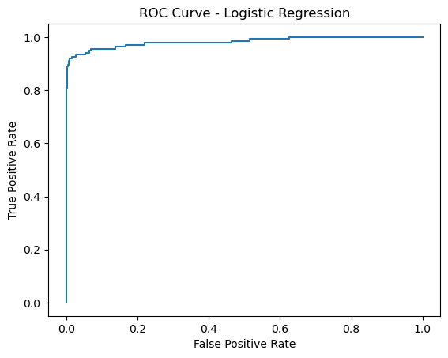

# Fraud Detection System Using Machine Learning

## Table of Contents
- [Project Overview](#project-overview)
- [Dataset](#dataset)
- [Project Structure](#project-structure)
- [Environment Setup](#environment-setup)
- [Data Preprocessing](#data-preprocessing)
- [Model Training](#model-training)
- [Evaluation Metrics](#evaluation-metrics)
- [Improvements](#improvements)
- [Conclusion](#conclusion)

## Introduction
This project builds a fraud detection system using machine learning techniques, based on the Credit Card Fraud Detection Dataset.

## Dataset
- **Source**: [Credit Card Fraud Detection Dataset on Kaggle](https://www.kaggle.com/datasets/mlg-ulb/creditcardfraud/data)
- **Description**: This dataset contains anonymized transaction features and labels (0 for non-fraud, 1 for fraud).
- **Download Instructions**: Download the dataset from Kaggle, save it in the `data/` folder of the project, and rename it to `creditcard.csv` if necessary.

## Environment Setup
- **Python** and **Jupyter Notebook**
- Required libraries: `pandas`, `numpy`, `scikit-learn`, `imbalanced-learn`, `matplotlib`, `seaborn`
- - Install dependencies: [requirements.txt](requirements.txt)

## Usage Example

Below is an example of how to load and preprocess the data, train a model, and make predictions on new data. Make sure to download the dataset from [Kaggle](https://www.kaggle.com/datasets/mlg-ulb/creditcardfraud/data) and place it in the `data/` folder as `creditcard.csv`.

### Code Example

```python
import pandas as pd
import numpy as np
from sklearn.model_selection import train_test_split
from sklearn.preprocessing import StandardScaler
from sklearn.linear_model import LogisticRegression
from sklearn.metrics import classification_report, confusion_matrix

# Load dataset
data_path = 'data/creditcard.csv'
data = pd.read_csv(data_path)

# Separate features and target
X = data.drop('Class', axis=1)
y = data['Class']

# Split the data into training and testing sets
X_train, X_test, y_train, y_test = train_test_split(X, y, test_size=0.3, random_state=42)

# Feature scaling
scaler = StandardScaler()
X_train = scaler.fit_transform(X_train)
X_test = scaler.transform(X_test)

# Initialize and train the model
model = LogisticRegression(class_weight='balanced', random_state=42)
model.fit(X_train, y_train)

# Make predictions
y_pred = model.predict(X_test)

# Evaluate the model
print("Confusion Matrix:\n", confusion_matrix(y_test, y_pred))
print("\nClassification Report:\n", classification_report(y_test, y_pred))
```

## Data Preprocessing
1. Handled class imbalance using SMOTE and under-sampling.
2. Scaled numerical features for model compatibility.

## Model Training
- Models used: Logistic Regression, Random Forest
- Class imbalance managed with `class_weight='balanced'`.

## Evaluation
### Confusion Matrix
Shows the performance of the model on non-fraud and fraud cases.



### Classification Report
- Precision: 6% for fraud cases, meaning many legitimate transactions are flagged as fraud.
- Recall: 93% for fraud cases, capturing most actual fraud cases.

### ROC Curve
- AUC score of 0.95, indicating strong separation between classes.

## Improvements
Future improvements include adjusting the classification threshold, feature engineering, and experimenting with advanced models like XGBoost.

## Conclusion
The model is highly effective in detecting fraud, with excellent recall and a high AUC score, though it could benefit from precision improvements.
